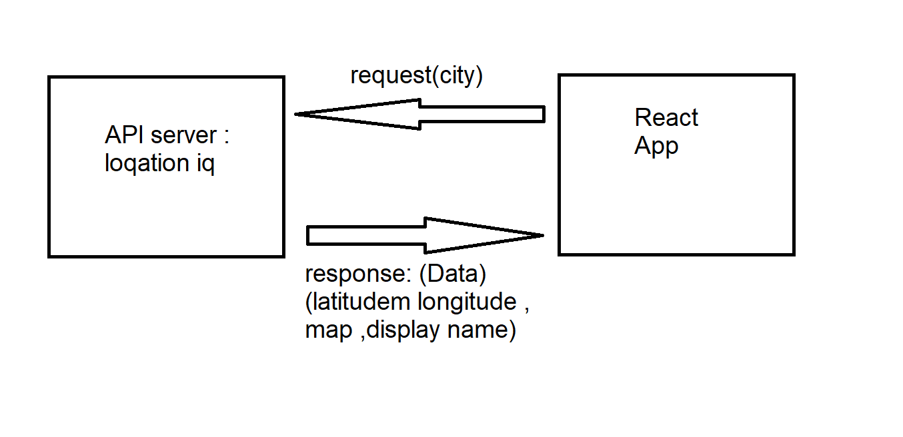

# request-response cycle

# city-explorer

**Author**: Ismail Al Amir
**Version**: v1.0.0

## Overview
we are building a search engin that user can search for a location by providing a name of the city that he want, and the application will give the user the latitude and longitude also will give him an snapshot to the map.

## Getting Started
 planning what we need to do ,
 management the time ,
 start coding.

## Architecture
React Component
API tool 

## Change Log

28-08-2022 5:00pm - Application now has a fully-functional express server.

## Credit and Collaborations
[Abdallah Mosa](https://github.com/AbdallahMosa)
  I really appreciate his collaborations.

## Time Estimates

1. Name of feature: Set up your React repository & API keys.

Estimate of time needed to complete: 30 min

Start time: 2:00 pm

Finish time: 3:00 pm

Actual time needed to complete: 1 hrs 

2. Name of feature: Locations

Estimate of time needed to complete: 1 hr

Start time: 3:00 pm

Finish time: 4:00 pm

Actual time needed to complete: 1 hrs 

3. Name of feature: Map

Estimate of time needed to complete: 1 hr

Start time: 4:00 pm

Finish time: 5:00 pm

Actual time needed to complete: 1 hrs 

4. Name of feature: Errors

Estimate of time needed to complete: 30 min

Start time: 5:00 pm

Finish time: 5:30 pm

Actual time needed to complete: 30 min

